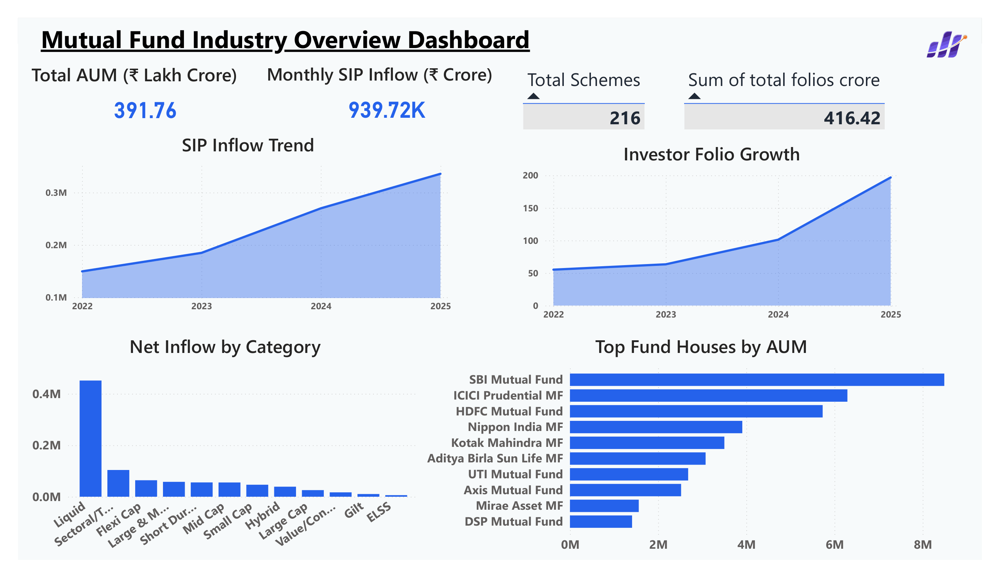
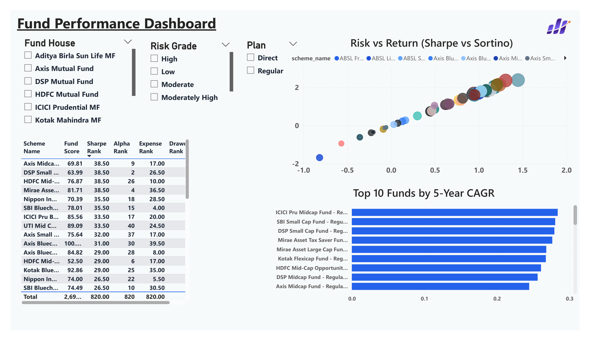
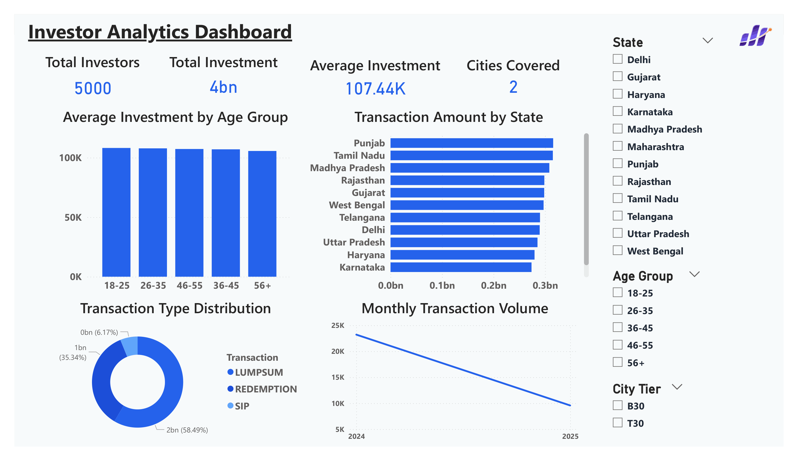
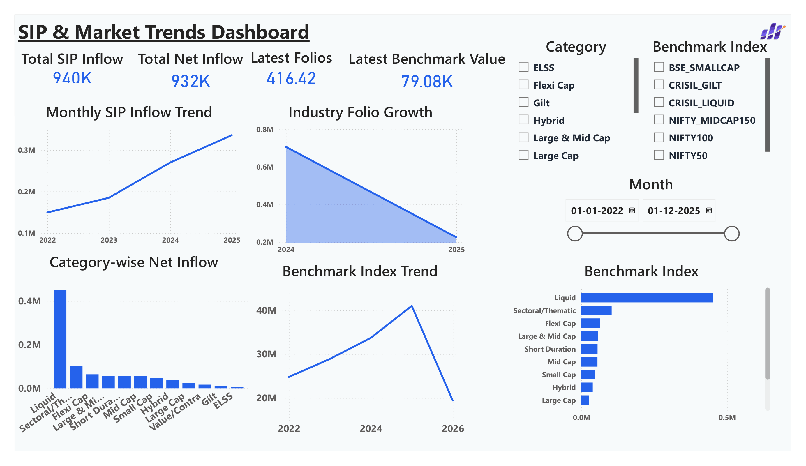
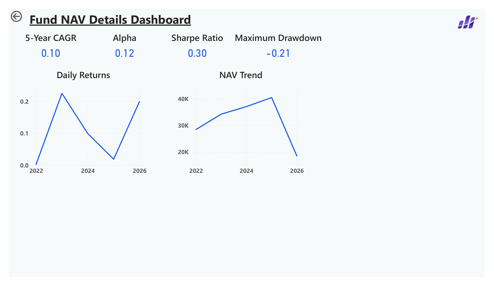

#  Bluestock Mutual Fund Analytics

An end-to-end Data Analytics project that analyzes mutual fund performance, investor behavior, SIP trends, and benchmark indices using **Python, SQL, SQLite, and Power BI**. The project also includes an automated ETL pipeline to fetch the latest NAV data, calculate performance metrics, and generate logs for scheduled execution.

---

#  Table of Contents

- Project Overview
- Objectives
- Tech Stack
- Project Structure
- Workflow
- Analytics Performed
- ETL Automation
- Power BI Dashboard
- Dashboard Preview
- Key Insights
- Future Enhancements
- Installation
- Project Outputs
- Author

---

#  Project Overview

The **Bluestock Mutual Fund Analytics** project provides a complete analytical solution for understanding mutual fund performance and investor trends.

The project covers the complete analytics lifecycle:

- Data Collection
- Data Cleaning
- Exploratory Data Analysis (EDA)
- Performance Analytics
- Advanced Analytics
- SQL Database Creation
- Power BI Dashboard Development
- ETL Automation
- Reporting

The dashboard enables users to explore fund performance, benchmark comparisons, SIP growth, investor behavior, and overall mutual fund industry trends.

---

#  Objectives

- Analyze mutual fund performance.
- Compare funds with benchmark indices.
- Study investor transaction patterns.
- Analyze SIP inflow trends.
- Measure fund risk using financial metrics.
- Build an interactive Power BI dashboard.
- Automate data updates using ETL.

---

#  Tech Stack

| Technology | Purpose |
|------------|---------|
| Python | Data Cleaning & Analytics |
| Pandas | Data Manipulation |
| NumPy | Numerical Analysis |
| Matplotlib | Data Visualization |
| SQLite | Database |
| SQL | Querying |
| Power BI | Dashboard Development |
| Git & GitHub | Version Control |
| VS Code | Development Environment |

---

#  Project Structure

```text
Mutual Fund Project
│
├── dashboard
│   ├── bluestock_m_f_dashboard.pbix
│   ├── bluestock_m_f_dashboard.pdf
│   ├── Industry_Overview_Dashboard.png
│   ├── Fund_Performance_Dashboard.png
│   ├── Investor_Analytics_Dashboard.png
│   ├── SIP_Market_Trends_Dashboard.png
│   └── Fund_NAV_Details_Dashboard.png
│
├── data
│   ├── raw
│   └── processed
│
├── logs
│   └── etl_log.txt
│
├── notebooks
│   ├── day1_eda.ipynb
│   ├── day2_cleaning.ipynb
│   ├── EDA_Analysis.ipynb
│   ├── Performance_Analytics.ipynb
│   ├── 05_advanced_analytics.ipynb
│   ├── final_eda_output.csv
│   └── advanced_analytics_output.csv
│
├── reports
│   ├── data_dictionary.md
│   ├── Final_Report.docx
│   ├── Final_Report.pdf
│   └── Presentation.pptx
│
├── scripts
│   ├── live_nav_fetch.py
│   ├── compute_metrics.py
│   ├── etl_pipeline.py
│   ├── recommender.py
│   └── schedule_etl.bat
│
├── sql
├── bluestock_mf.db
├── requirements.txt
├── .gitignore
└── README.md
```

---

#  Project Workflow

```text
Data Collection
        ↓
Data Cleaning
        ↓
Exploratory Data Analysis
        ↓
Performance Analytics
        ↓
Advanced Analytics
        ↓
SQLite Database
        ↓
Power BI Dashboard
        ↓
ETL Automation
        ↓
Reports & Documentation
```

---

#  Analytics Performed

## Data Cleaning

- Removed duplicate records
- Handled missing values
- Standardized data formats
- Converted date columns
- Validated transaction records

## Exploratory Data Analysis

- NAV Trend Analysis
- AUM Growth Analysis
- SIP Trend Analysis
- Category-wise Inflows
- Investor Demographics
- Geographic Distribution
- Correlation Analysis

## Performance Analytics

- Daily Returns
- CAGR
- Sharpe Ratio
- Sortino Ratio
- Alpha
- Beta
- Maximum Drawdown
- Tracking Error
- Fund Scorecard

## Advanced Analytics

- Comparative Fund Analysis
- Risk Analysis
- Performance Ranking
- Investor Insights
- Benchmark Comparison

---

# ⚙ ETL Automation

The project includes an automated ETL pipeline for updating mutual fund data.

### ETL Process

- Fetch latest NAV data
- Clean and process data
- Calculate performance metrics
- Save processed datasets
- Generate execution logs

### Scripts Used

- live_nav_fetch.py
- compute_metrics.py
- etl_pipeline.py
- schedule_etl.bat

Execution logs are automatically stored inside the **logs** folder.

---

#  Power BI Dashboard

The dashboard contains five interactive pages.

### 1. Industry Overview

- Industry KPIs
- AUM Analysis
- SIP Growth
- AMC Comparison

### 2. Fund Performance

- Return Comparison
- Risk Metrics
- Benchmark Comparison
- Fund Scorecard

### 3. Investor Analytics

- Investor Demographics
- Transaction Analysis
- Geographic Distribution

### 4. SIP & Market Trends

- Monthly SIP Trend
- Category Inflows
- Market Performance

### 5. Fund NAV Details

- Historical NAV Trends
- Fund Performance Analysis

---

#  Dashboard Preview

## Industry Overview



## Fund Performance



## Investor Analytics



## SIP & Market Trends



## Fund NAV Details



---

#  Key Insights

- Mutual fund SIP investments have shown consistent long-term growth.
- Large-cap funds generally demonstrated stable long-term performance.
- Risk-adjusted returns varied significantly across fund categories.
- Benchmark comparison helped identify outperforming funds.
- Interactive dashboards enable efficient exploration of fund performance and investor trends.

---

#  Future Enhancements

- Live API Integration
- Power BI Service Deployment
- Predictive Analytics
- Forecasting Models
- Email Notifications
- Real-time Dashboard Refresh

---

#  Installation

## Clone the Repository

```bash
git clone https://github.com/your-username/bluestock-mutual-fund-analytics.git
```

## Install Dependencies

```bash
pip install -r requirements.txt
```

## Run ETL Pipeline

```bash
python scripts/etl_pipeline.py
```

## Open Dashboard

Open the following file using Power BI Desktop.

```text
dashboard/bluestock_m_f_dashboard.pbix
```

---

#  Project Outputs

- Cleaned Dataset
- SQLite Database
- EDA Report
- Performance Metrics
- Advanced Analytics
- Power BI Dashboard
- ETL Logs
- Final Report
- Presentation

---

#  Author

**Ashwini Sharma**

**Data Analytics Trainee**

### Skills

- Python
- SQL
- SQLite
- Power BI
- Microsoft Excel
- Data Analytics
- Data Visualization
- ETL Automation

---

#  Acknowledgement

This project was developed as part of a Data Analytics training program to demonstrate practical skills in data collection, data cleaning, exploratory data analysis, financial performance analytics, dashboard development, ETL automation, and business intelligence using mutual fund data.

If you found this project useful, consider giving it a ⭐ on GitHub.
